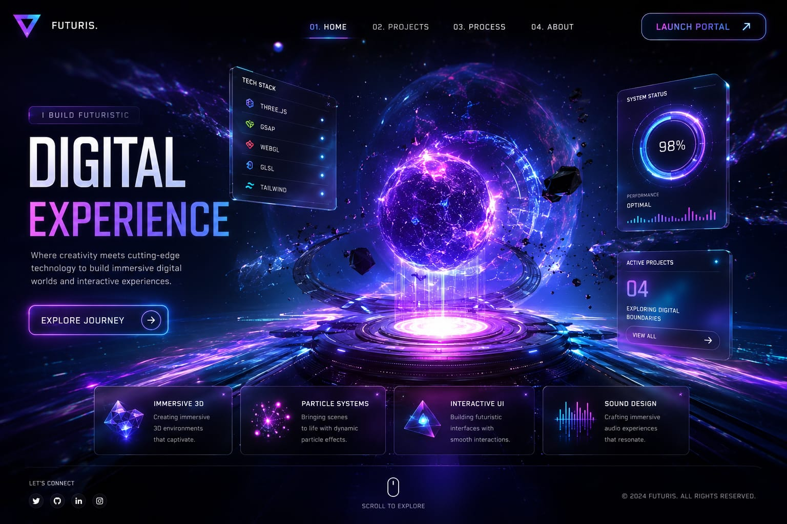
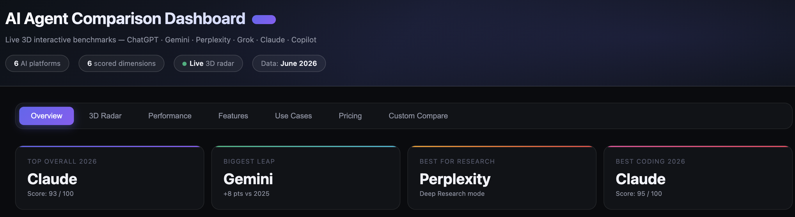
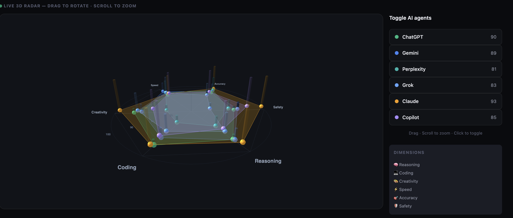
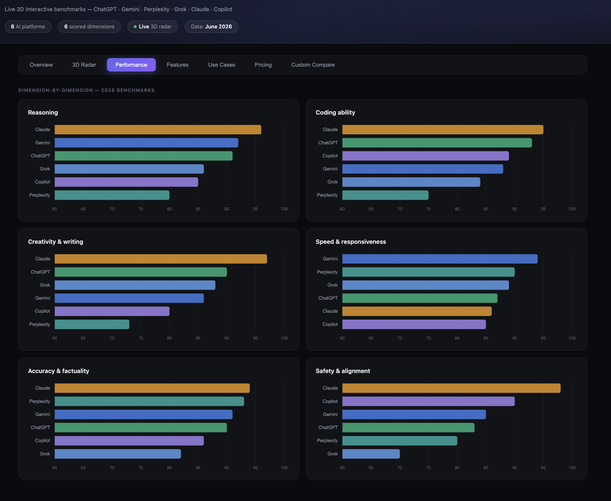
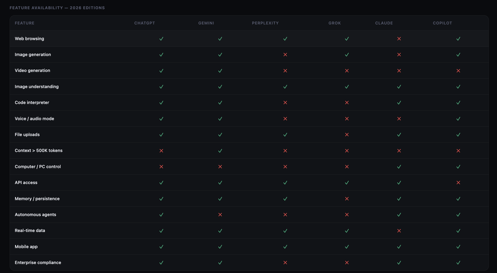
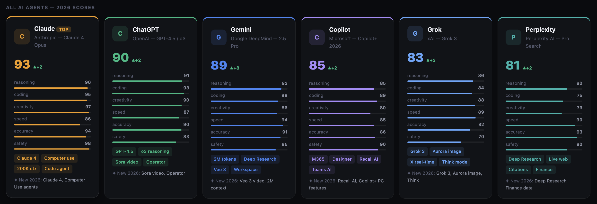

# AI Market Intelligence Dashboard 2026

Executive Analytics Platform for Comparative Evaluation of Leading Generative AI Systems

## Live Dashboard

[Open Live Dashboard](https://urstrulyghc-5.github.io/AI-Market-Intelligence-Dashboard-2026/)

---

# AI Market Intelligence Dashboard 2026

Executive Analytics Platform for Comparative Evaluation of Leading Generative AI Systems

## Live Dashboard

[https://urstrulyghc-5.github.io/AI-Market-Intelligence-Dashboard-2026/]

---

## Project Overview

The AI Market Intelligence Dashboard 2026 is an interactive Business Intelligence and Analytics platform designed to compare leading Generative AI ecosystems including ChatGPT, Gemini, Claude, Perplexity, Grok and Microsoft Copilot.

The dashboard combines benchmarking, KPI monitoring, data visualization and executive reporting principles to provide a comprehensive comparison of AI capabilities.

---

## Dashboard Preview

### Executive Overview

### AI Performance Analytics

### Comparative Intelligence

### Feature Matrix

### Ranking Engine

---

## Business Problem

Organizations are increasingly adopting Generative AI solutions across research, software development, business operations and content creation. Selecting the right AI platform requires a structured evaluation framework that considers performance, usability, innovation and enterprise readiness.

---

## Project Objectives

* Compare leading AI ecosystems
* Visualize benchmark performance
* Support technology decision-making
* Demonstrate Business Intelligence concepts
* Showcase data storytelling techniques
* Develop an interactive analytics platform

---

## Dashboard Features

* Interactive KPI Cards
* AI Performance Benchmarking
* Comparative Analytics
* Feature Comparison Matrix
* Executive Reporting Dashboard
* AI Ranking System
* Interactive Visualizations
* Market Intelligence Insights

---

## Technology Stack

Frontend

* HTML5
* CSS3
* JavaScript

Visualization

* Chart.js
* Three.js

Analytics Concepts

* Business Intelligence
* KPI Monitoring
* Comparative Benchmarking
* Data Storytelling
* Executive Analytics

---

## Key Insights

### Claude

Strong performance in reasoning, coding and analytical workflows.

### ChatGPT

Comprehensive multimodal ecosystem with broad adoption.

### Gemini

Large-context capabilities and deep ecosystem integration.

### Perplexity

Research-focused experience with source-driven responses.

### Grok

Real-time information integration and conversational insights.

### Microsoft Copilot

Enterprise productivity and workflow integration.

---

## Future Enhancements

* Real-time AI benchmark updates
* User-customizable scoring models
* Industry-specific AI recommendations
* Predictive analytics module
* Interactive scenario simulations

---

## Author

G Hari Charan

## Repository

https://github.com/urstrulyghc-5/AI-Market-Intelligence-Dashboard-2026

Analytics & Business Intelligence Portfolio Project

2026
